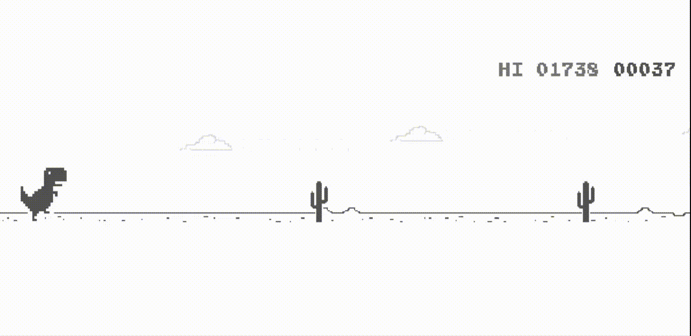

  

 

# Shivam

**VLSI Design & Verification Engineer**

---

### Currently

| 🔭 Working on | 🌱 Exploring |
|---|---|
| Design & Verification at SoC level | Advanced UVM methodologies & Formal Verification |

---

### What I do

- ◉ &nbsp;Designing digital logic and verifying every corner case
- ◉ &nbsp;Turning waveforms into insights
- ◉ &nbsp;Finding bugs before they become silicon
- ◉ &nbsp;Ask me about **Verilog**, **SystemVerilog**, and **FPGA-based system design**

---

> *Usually one simulation away from either a breakthrough — or a brand new bug.*
